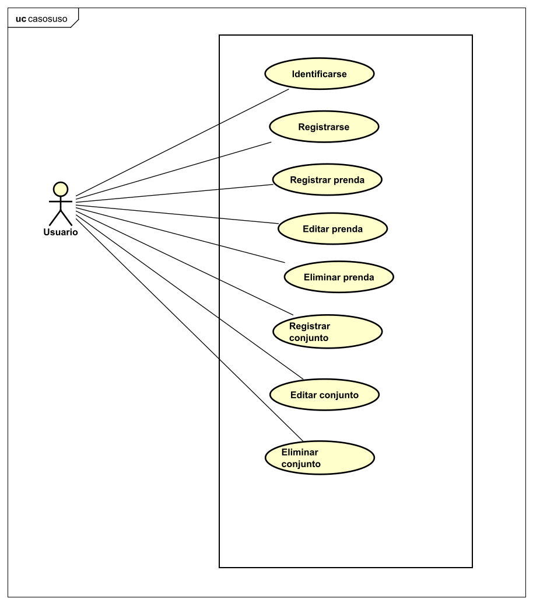
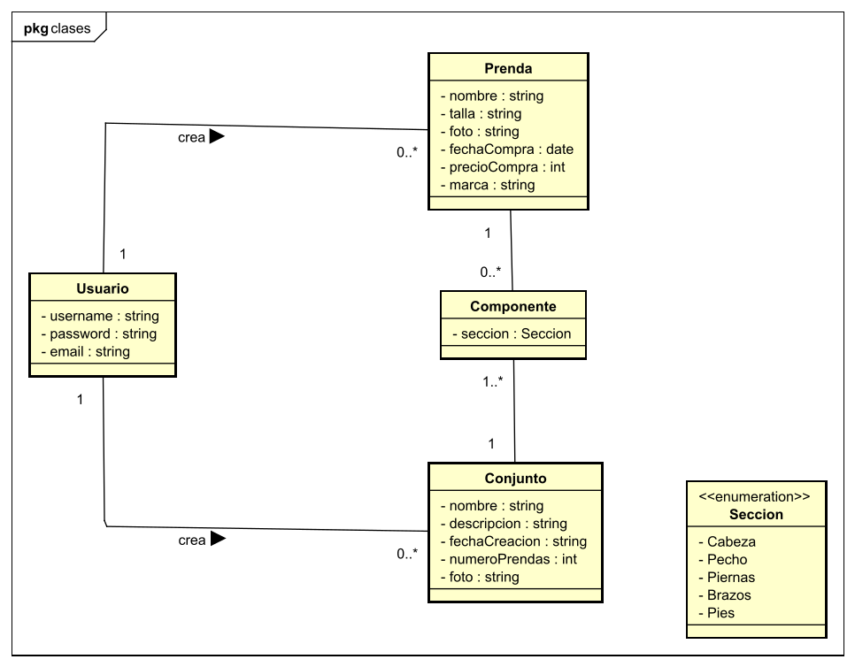
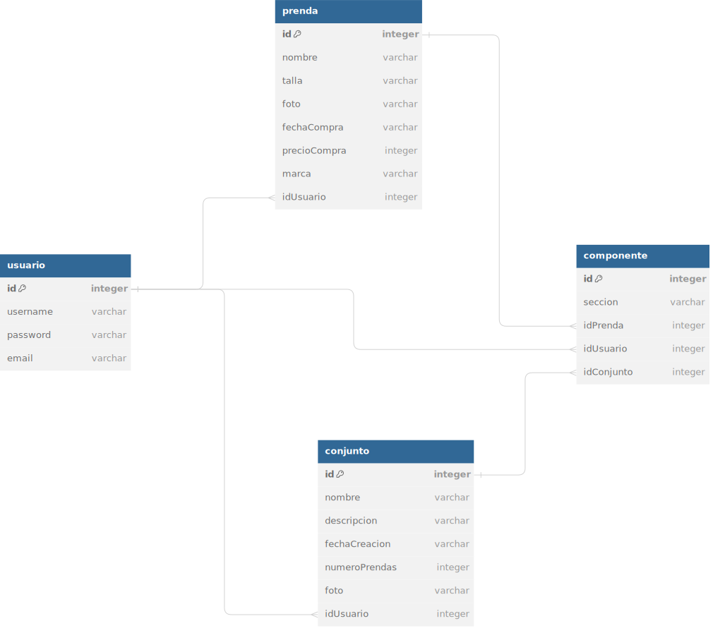
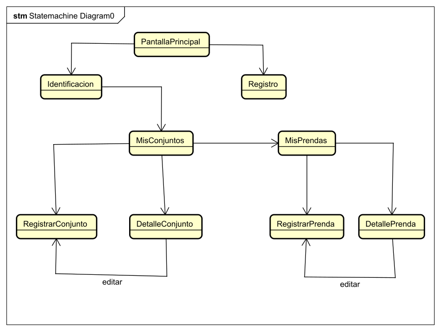
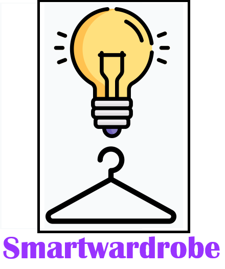
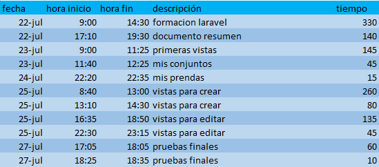

<h1>Documento resumen del proyecto para crear la aplicación "Smartwardrobe"</h1>

<ol>
<h2><li>Resumen del proyecto</li></h2>

Esta aplicación permitirá gestionar las prendas y los conjuntos que tenga un usuario. El usuario puede registrar prendas y a partir de ellas crear conjuntos. De cada prenda deberá introducir varios datos como la marca, talla o datos de compra. En cada conjunto se deberán definir la prendas incluidas y una descripción del conjunto.

<h2><li>Aplicaciones similares</li></h2>

Se han encontrado diferentes aplicaciones en la Play Store que se pueden utilizar como referencia:

<ol>
  <li>Acloset</li>
  <li>Miarmario</li>

</ol>

<h2><li>Tecnologías utilizadas</li></h2>

Se van a utilizar las siguientes tecnologías:

<ul>

<li>Frontend y Backend: Laravel</li>
<li>Base de datos: MySQL</li>
</ul>

<h2><li>Funcionalidad de la aplicación. Casos de uso</li></h2>

A continuación se expone el diagrama de casos de uso de la aplicación:

<h2><li>Diagrama de clases</li></h2>

A continuacion se expone el diagrama de clases de la aplicación:

<h2><li>Estructura de la base de datos</li></h2>

A continuación se muestra la estructura de la base de datos relacional con las tablas, las claves primarias y las claves foráneas.

<h2><li>Estructura del backend</li></h2>

En el backend se ha construido una API REST que contiene diferentes rutas a las que el frontend puede realizar peticiones. En cada ruta, un controlador realiza las operaciones solicitadas en la base de datos mediante una consulta MySQL devuelve una respuesta al frontend.

<h2><li>Estructura del frontend</li></h2>
La aplicación contará con las siguientes vistas:
<ul>
<li>PantallaPrincipal: esta vista funcionará como una landing page.</li>
<li>Identificación: esta vista contará con un formulario para que el usuario se identifique.</li>
<li>Registro: esta vista contará con un formulario para que el usuario se registre. </li>
<li>MisConjuntos: en esta vista se mostrarán todos los conjuntos que haya guardado el usuario.</li>
<li>MisPrendas: en esta vista se mostrarán todas las prendas que haya guardado el usuario.</li>
<li>DetalleConjunto: en esta vista se mostrarán los detalles de un conjunto.</li>
<li>DetallePrenda: en esta vista se mostrarán los detalles de una prenda.</li>
<li>RegistrarPrenda: en esta vista se podrá crear una prenda introduciendo los campos del formulario. Además también servirá para editar los datos de una prenda, ya que puede cargar los datos de una prenda a editar.</li>
<li>RegistrarConjunto: en esta vista se podrá crear un conjunto introduciendo los campos del formulario. Además también servirá para editar los datos de un conjunto, ya que puede cargar los datos de un conjunto a editar.</li>

</ul>

La navegación entre las diferentes vistas en la siguiente:

<h2><li>Bocetos del frontend</li></h2>
Se han realizado bocetos con Figma con la idea básica de como será la aplicación. Estos bocetos han servido de guía para el desarrollo de la aplicación, sin embargo durante el desarrollo se han encontrado mejoras sobre estos bocetos. Por lo tanto el resultado final, combina los bocetos con ideas aparecidas durante el desarrollo. Los bocetos se encuentran en el pdf adjunto bocetos-smartwardrobe.

<h2><li>Detalles de la aplicacion</li></h2>
<ul>

<li>Colores:
<ul>
<li>Morado:#8D00FC</li>
</ul>
</li>
<li>Icono:</li>

</ul>
<h2><li>Registro del tiempo</li></h2>

A continuación se detalla el tiempo utilizado para el proyecto: 

<strong>Tiempo empleado: 1265 minutos (21 horas y 5 minutos)</strong>

<h2><li>Resultado final: vídeo youtube y repositorio</li></h2>
Repositorio Github:

<h2><li>Conclusiones</li></h2>
He aprendido a crear una aplicación web con Laravel. Además he podido crear una API REST con Laravel que accede a una base de datos MySQL.

</ol>